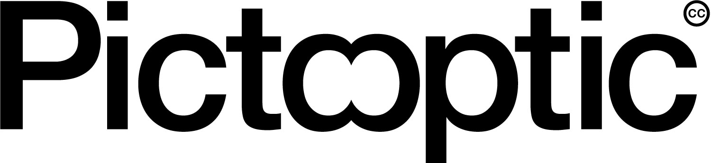
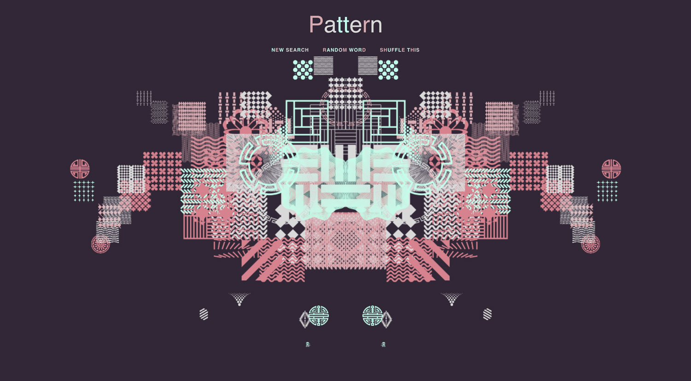
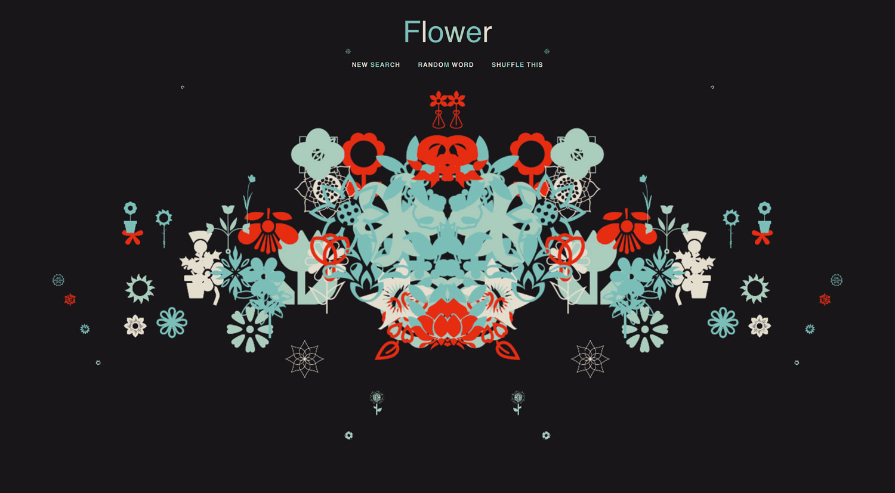
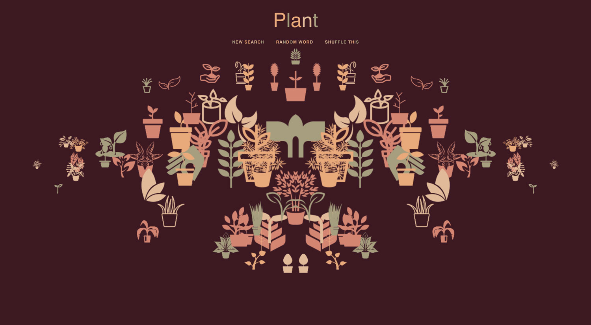

<!-- Generative artwork using node/browser and The Noun Project API.   -->
Blog post and more details:  
[Generative Art with The Noun Project API](http://www.philipbell.org)  

## Live Demo  
You can view the project in real-time here:  
[www.pictooptic.com](https://www.pictooptic.com)  

## Screen Shots
Here are a few examples.  

## Technology:
- [The Noun Project API](http://api.thenounproject.com/)  
- [Pixi.js](https://www.pixijs.com/)  
- [GreenSock](https://greensock.com/)  
- [Bodymovin](https://github.com/bodymovin/bodymovin)  
- [Typeahead.js](https://twitter.github.io/typeahead.js/)  
- [Express](https://expressjs.com/)  

