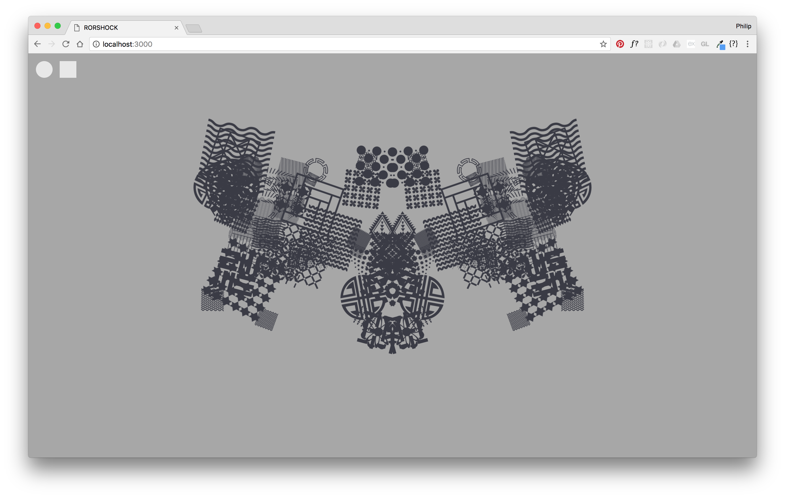
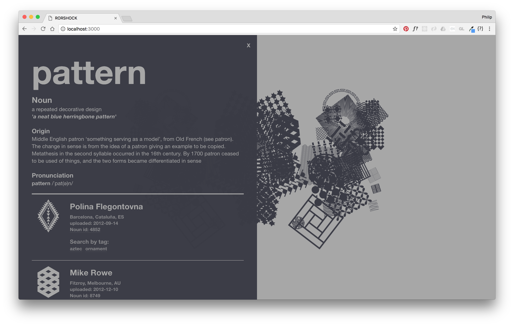

# RorShock
Psychedelic Semiotics

  
When a designer distills an idea into an icon, it's subjectively rendered to it's purest form.
How might this concept be presented to display the variety of ways that ideas are graphically distilled?

### Technology
- JavaScript
- GreenSock
- Colour Lovers API
- The Noun Project API
- Express

